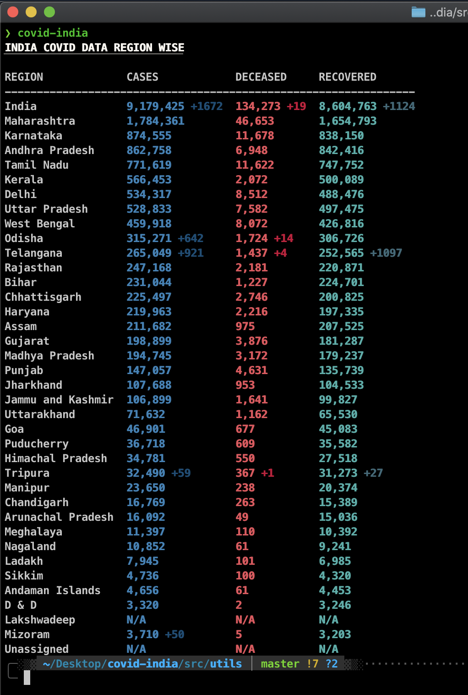
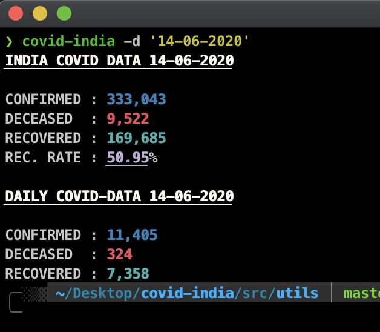
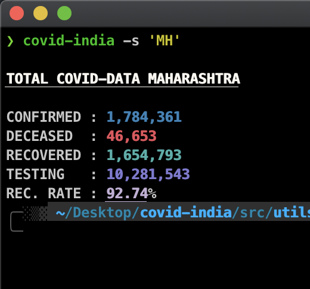

<h1 align="center">
	<br>
	
	<br>
	<br>
	<br>
</h1>

> A CLI-Tool to get 🇮🇳Indian Covid Data 🦠

Made with the API by https://github.com/covid19india

## Highlights 🚀

- Live Covid Data of Indian States / UTs
- State / UT Wise Daily Data
- Indian Covid Data by Date from `2020-01-30` to `today`

## Install 🕹

`npm i -g covid-india` or `npm i covid-india`

## Usage 🧪

```bash
Options:
  -v, --vers          output the current version
  -d, --date <type>   Specify Date dd-mm-yyyy
  -s, --state <type>  State/UT(Code) of India
  -t, --type <type>   get Total || Daily stats
  -a, --author        Get to know the Author
  -h, --help          display help for command
```

## Examples 🧬

`covid-india`

Gives Live India's and State/UT Cumulative and Daily Changes by Cases , Deceased and Recoveries.



`covid-india -d <dd-mm-yyyy>`

Gives Covid Data on the Specified Date (dd-mm-yyyy) format



`covid-india -s <state-code>`

Gives Covid Data on the Specified Date (dd-mm-yyyy) format


